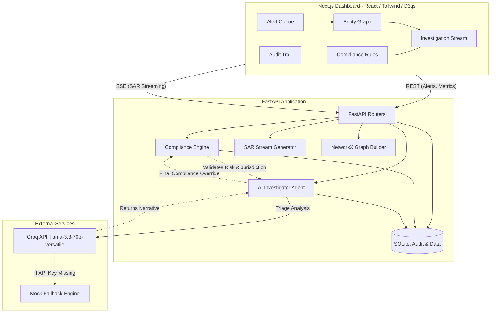

# Sentinel v2: Architecture & System Design

**Domain-Specialized AI Agent with Compliance Guardrails**

Sentinel v2 is a full-stack, AI-powered Anti-Money Laundering (AML) platform. It orchestrates complex investigation workflows using a deterministic compliance engine acting as a safety wrapper around a non-deterministic Large Language Model (LLM). 

## High-Level Architecture Diagram

## Core Agent Components & Roles

### 1. The AI Investigator Agent (`ai_investigator.py`)
- **Role**: Orchestrates the triage workflow. Evaluates financial transaction paths and entity metadata for AML typologies (Structuring, Layering, Shell Companies) and synthesizes a risk rationale.
- **Communication**: Uses the Groq API (`llama-3.3-70b-versatile`) for high-speed, reasoning-based analysis.

### 2. The Compliance Engine Guardrail (`compliance_engine.py`)
- **Role**: The deterministic safety layer. Evaluates transactions against hardcoded regulatory frameworks (FATF, FinCEN CTR limits, OFAC lists).
- **Communication**: Acts as an interception middleware. It runs *before* and *after* the AI analysis. If the AI suggests "No Action" but a hard rule is broken, the Guardrail overrides the AI and enforces a `FILE_SAR` order.

### 3. Graph Builder / Entity Extraction (`entity_extraction.py`)
- **Role**: Converts tabular transaction data into a mathematically robust Directed Graph using NetworkX.
- **Communication**: Feeds directly into the D3.js visualization on the frontend, calculating dynamic risk weights and highlighting SDN (Specially Designated Nationals) hits.

### 4. SAR Stream Generator (`sar_generator.py`)
- **Role**: Converts the structured triage response into a readable, regulator-ready Suspicious Activity Report (SAR) narrative.
- **Communication**: Streams chunks to the Next.js frontend via Server-Sent Events (SSE) for low-latency UI.

### 5. Audit Logger (`audit_logger.py`)
- **Role**: Maintains legal non-repudiation. Every AI decision and guardrail override is cryptographically hashed (SHA-256) and saved to a tamper-evident SQLite database (`aml_audit.db`).
