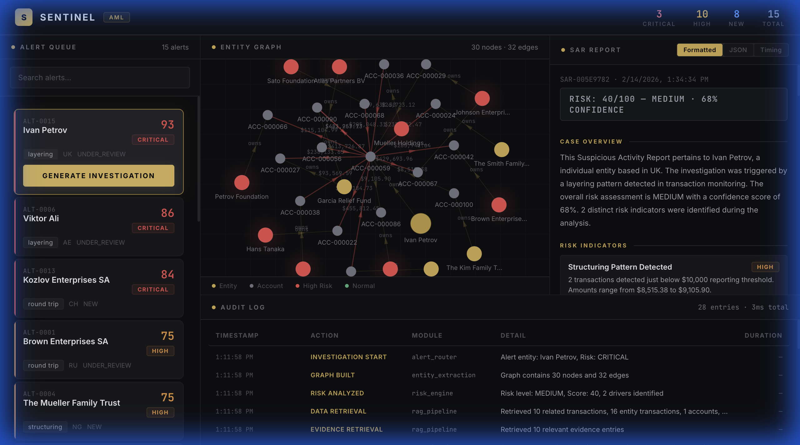

# Sentinel — AML Investigator Agent

A full-stack Anti-Money Laundering co-investigator that automates alert triage, entity graph construction, risk analysis, and Suspicious Activity Report (SAR) generation — **100% local, zero cost, no external APIs**.

> **[Live Demo →  sentinel-aml-two.vercel.app](https://sentinel-aml-two.vercel.app)**



---

## Key Features

| Feature | Description |
|---------|-------------|
| **Alert Queue** | Prioritized queue of 15 synthetic AML alerts with risk scoring (CRITICAL/HIGH/MEDIUM/LOW) |
| **Entity Graph** | Interactive force-directed graph visualization showing entity-account-transaction relationships |
| **Risk Engine** | Rule-based detection of 7 AML patterns: structuring, sanctions proximity, high-risk jurisdictions, rapid movement, round-trips, shell companies, volume anomalies |
| **SAR Generator** | Deterministic structured SAR reports with evidence citations, timeline, linked entities, and recommended actions |
| **Audit Trail** | Full investigation traceability — every step logged with timestamps and durations |
| **Timing Comparison** | Simulated 30%+ reduction in investigation time vs. manual process |

---

## Architecture

```
┌─────────────────────────────────────────────────────────┐
│                   Next.js Frontend :3000                 │
│  ┌──────────┐  ┌──────────┐  ┌────────┐  ┌───────────┐ │
│  │Alert Queue│  │Entity    │  │SAR     │  │Audit Log  │ │
│  │          │  │Graph     │  │Panel   │  │           │ │
│  └──────────┘  └──────────┘  └────────┘  └───────────┘ │
└────────────────────────┬────────────────────────────────┘
                         │ API Proxy
┌────────────────────────┴────────────────────────────────┐
│                  FastAPI Backend :8000                    │
│  ┌──────────────┐  ┌──────────────┐  ┌───────────────┐  │
│  │Data Ingestion│  │Entity        │  │Risk Engine    │  │
│  │              │  │Extraction    │  │(7 rules)      │  │
│  └──────────────┘  └──────────────┘  └───────────────┘  │
│  ┌──────────────┐  ┌──────────────┐  ┌───────────────┐  │
│  │RAG Pipeline  │  │SAR Generator │  │Audit Logger   │  │
│  │              │  │(templates)   │  │               │  │
│  └──────────────┘  └──────────────┘  └───────────────┘  │
└─────────────────────────────────────────────────────────┘
```

---

## Tech Stack

- **Backend**: Python, FastAPI, NetworkX, Pydantic
- **Frontend**: Next.js 14, React 18, TypeScript, HTML5 Canvas
- **Data**: Synthetic JSON (50 entities, 100 accounts, 500 transactions, 15 alerts)
- **Testing**: pytest (13 API tests)
- **External APIs**: None — fully self-contained

---

## Quick Start

### Prerequisites
- Python 3.10+
- Node.js 18+

### 1. Backend

```bash
cd backend
pip install -r requirements.txt
python scripts/generate_dataset.py
uvicorn main:app --reload --port 8000
```

### 2. Frontend

```bash
cd frontend
npm install
npm run dev
```

### 3. Open Dashboard

Navigate to **http://localhost:3000**

1. Select an alert from the queue (sorted by risk score)
2. Click **Generate Investigation**
3. View the entity graph, SAR report, and audit trail

### 4. Run Tests

```bash
cd backend
python -m pytest tests/test_api.py -v
```

---

## API Endpoints

| Endpoint | Method | Description |
|----------|--------|-------------|
| `GET /alerts` | GET | List all alerts (filterable by risk_level) |
| `GET /alerts/{id}` | GET | Alert detail with transactions |
| `POST /alerts/{id}/investigate` | POST | Full investigation pipeline |
| `GET /alerts/{id}/graph` | GET | Entity relationship graph |
| `POST /alerts/{id}/sar` | POST | Generate SAR report |
| `GET /alerts/{id}/audit` | GET | Investigation audit trail |
| `GET /timing` | GET | Manual vs Sentinel timing comparison |

---

## Project Structure

```
AML/
├── backend/
│   ├── main.py                    # FastAPI entry point
│   ├── models.py                  # Pydantic schemas
│   ├── requirements.txt
│   ├── data/                      # Generated synthetic data
│   ├── scripts/
│   │   └── generate_dataset.py    # Synthetic data generator
│   ├── services/
│   │   ├── data_ingestion.py      # JSON data loader
│   │   ├── entity_extraction.py   # NetworkX graph builder
│   │   ├── risk_engine.py         # Rule-based risk scoring
│   │   ├── rag_pipeline.py        # Evidence retrieval + SAR
│   │   └── audit_logger.py        # Investigation audit trail
│   ├── routers/
│   │   ├── alerts.py              # Alert CRUD + investigate
│   │   ├── graph.py               # Graph endpoint
│   │   ├── sar.py                 # SAR generation
│   │   ├── audit.py               # Audit trail
│   │   └── timing.py              # Timing comparison
│   └── tests/
│       └── test_api.py            # 13 API tests
├── frontend/
│   ├── app/
│   │   ├── layout.tsx             # Root layout
│   │   ├── page.tsx               # Dashboard (4-panel)
│   │   └── globals.css            # Design system
│   ├── components/
│   │   ├── AlertQueue.tsx         # Alert list + search
│   │   ├── EntityGraph.tsx        # Canvas force-directed graph
│   │   ├── SARPanel.tsx           # SAR report viewer
│   │   ├── AuditLog.tsx           # Audit trail table
│   │   └── TimingChart.tsx        # Timing comparison bars
│   ├── next.config.js
│   ├── tsconfig.json
│   └── package.json
└── README.md
```

---

## Risk Detection Rules

| Rule | What it detects |
|------|----------------|
| Structuring | Transactions just below $10,000 reporting threshold |
| Sanctions Proximity | Connections to sanctioned entities |
| High-Risk Jurisdictions | Activity involving FATF high-risk countries |
| Rapid Movement | Funds moved through multiple accounts within 48 hours |
| Round-Trip | Money returning to originating accounts |
| Shell Companies | Transactions involving shell company entities |
| Volume Anomaly | Transaction volumes exceeding 3x baseline |

---

## Design

Premium dark theme with charcoal base and gold accents. Enterprise-grade financial terminal aesthetic with:
- JetBrains Mono for data/metrics
- Inter for UI text
- Force-directed canvas graph with physics simulation
- Responsive 4-panel grid layout

---

## License

MIT
